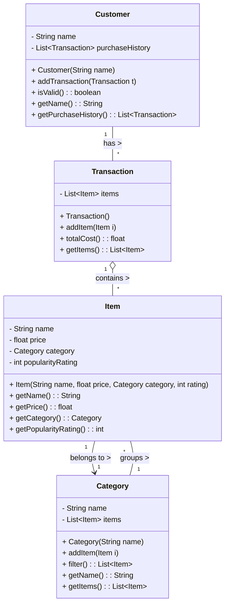

# ByteBites UML Class Diagram

```mermaid
classDiagram
    class Customer {
        - String name
        - List~Transaction~ purchaseHistory
        + Customer(String name)
        + addTransaction(Transaction t)
        + isValid() : boolean
        + getName() : String
        + getPurchaseHistory() : List~Transaction~
    }

    class Transaction {
        - List~Item~ items
        + Transaction()
        + addItem(Item i)
        + totalCost() : float
        + getItems() : List~Item~
    }

    class Item {
        - String name
        - float price
        - Category category
        - int popularityRating
        + Item(String name, float price, Category category, int rating)
        + getName() : String
        + getPrice() : float
        + getCategory() : Category
        + getPopularityRating() : int
    }

    class Category {
        - String name
        - List~Item~ items
        + Category(String name)
        + addItem(Item i)
        + filter() : List~Item~
        + getName() : String
        + getItems() : List~Item~
    }

    Customer "1" -- "*" Transaction : has >
    Transaction "1" o-- "*" Item : contains >
    Item "1" --> "1" Category : belongs to >
    Category "1" -- "*" Item : groups >
```