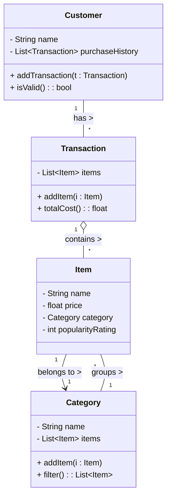

```mermaid
classDiagram
    class Customer {
        - String name
        - List~Transaction~ purchaseHistory
        + addTransaction(t : Transaction)
        + isValid() : bool
    }

    class Transaction {
        - List~Item~ items
        + addItem(i : Item)
        + totalCost() : float
    }

    class Item {
        - String name
        - float price
        - Category category
        - int popularityRating
    }

    class Category {
        - String name
        - List~Item~ items
        + addItem(i : Item)
        + filter() : List~Item~
    }

    Customer "1" -- "*" Transaction : has >
    Transaction "1" o-- "*" Item : contains >
    Item "1" --> "1" Category : belongs to >
    Category "1" -- "*" Item : groups >
```
